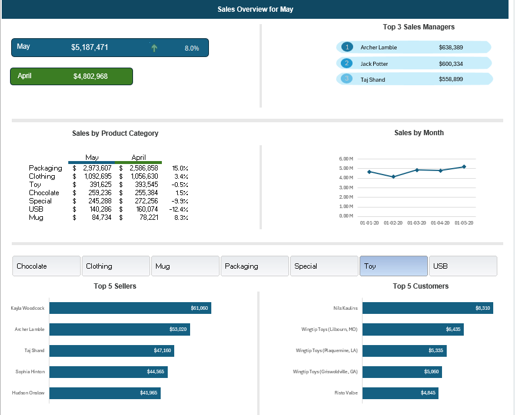

# -Power-Query-Excel-Dashboard-Project
📊 Power Query &amp; Excel Dashboard Project
I’m excited to share my latest project, where I combined key learnings from my course with new techniques to create an interactive and insightful dashboard! 🚀

🔹 Key Achievements:

✅ Data Import & Transformation: Imported data from a large text file using Power Query and set up a single connection to the master data file.

✅ Efficient Query Setup: Created 3 separate queries from the master data using referencing queries.

✅ Dynamic Calendar Table: Built a calendar table with logic to flag the latest and previous month, using conditional columns and M code tweaks.

✅ Data Modeling: Established relationships between tables using Excel’s Data Model for seamless analysis.

✅ Advanced Pivot Tables: Extracted key insights using multiple Pivot Tables.

✅ Interactive Dashboard Elements: Connected Excel shapes & text boxes to cell values for a dynamic experience.

✅ Visual Emphasis: Applied conditional formatting & icon sets to highlight percentage differences.

✅ Creative Display Trick: Used the linked picture technique to place conditional formatting results anywhere on the dashboard.

✅ Enhanced Interactivity: Implemented Pivot Charts & Slicers for better user engagement.

✅ User-Friendly Design: Restricted the user view to focus solely on the dashboard by hiding unused columns & rows.

This project was a great learning experience in data transformation, visualization, and dashboard design. Looking forward to applying these skills to real-world datasets!

